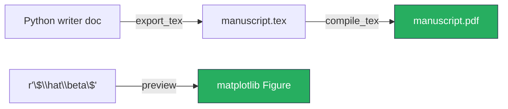

# scitex-tex

<p align="center">
  <a href="https://scitex.ai">
    
  </a>
</p>

<p align="center"><b>LaTeX helpers — export to .tex, compile to PDF, preview images, vector formatting.</b></p>

<p align="center">
  <a href="https://scitex-tex.readthedocs.io/">Full Documentation</a> · <code>uv pip install scitex-tex[all]</code>
</p>

<!-- scitex-badges:start -->
<p align="center">
  <a href="https://pypi.org/project/scitex-tex/"></a>
  <a href="https://pypi.org/project/scitex-tex/"></a>
  <a href="https://github.com/ywatanabe1989/scitex-tex/actions/workflows/test.yml"></a>
  <a href="https://codecov.io/gh/ywatanabe1989/scitex-tex"></a>
  <a href="https://scitex-tex.readthedocs.io/en/latest/"></a>
  <a href="https://www.gnu.org/licenses/agpl-3.0"></a>
</p>
<!-- scitex-badges:end -->

---

## Problem and Solution

| # | Problem | Solution |
|---|---------|----------|
| 1 | **Hand-authored `.tex` from Python is brittle** — escaping `_` / `&` / `%` and locating the right `pdflatex` invocation eats hours per paper | **`export_tex` + `compile_tex`** — writer doc → `.tex` → `.pdf` in two calls; `CompileResult` exposes the pdf path + log on failure |
| 2 | **Previewing a math snippet means firing up a full LaTeX project** | **`preview([r"$\sum x_i$"])`** — single-call rendering via matplotlib returning a `Figure`; no system TeX install required |
| 3 | **Converting strings to LaTeX vector notation** | **`to_vec("AB")`** — wraps a label in `\overrightarrow{\mathrm{...}}` with automatic fallback |

## Architecture

```
scitex_tex/
├── _export.py        # writer doc  → .tex string + file; .tex → .pdf via pdflatex/xelatex
├── _preview.py       # snippet     → matplotlib Figure (no system TeX needed)
└── _to_vec.py        # string      → LaTeX \overrightarrow form
```

```mermaid
flowchart LR
    Doc[Writer Doc<br/>Python dict/object] --> Exp[export_tex]
    Exp --> Tex[manuscript.tex]
    Tex --> Cmp[compile_tex]
    Cmp --> Pdf[manuscript.pdf]
    Snip[r'\$\\sum x_i\$'] --> Prv[preview]
    Prv --> Fig[matplotlib Figure]
    Label[AB] --> Vec[to_vec]
    Vec --> Latex[r'\overrightarrow{\mathrm{AB}}']
```

<p align="center"><sub><b>Figure 1.</b> Module layout. Three modules — export+compile, preview, vector notation — each callable independently.</sub></p>

## Installation

```bash
pip install scitex-tex
```

## Quick Start

```python
import scitex_tex as tx

# Convert a SciTeX-style writer doc → .tex
tx.export_tex(doc, "manuscript.tex")

# Compile .tex → .pdf (returns CompileResult)
result = tx.compile_tex("manuscript.tex")

# Render LaTeX snippets to a matplotlib Figure
fig = tx.preview([r"$\sum_{i=1}^N x_i$", r"$\alpha + \beta$"])

# Convert a string to LaTeX vector notation
tx.to_vec("AB")  # → \overrightarrow{\mathrm{AB}}
```

## 1 Interfaces

<details open>
<summary><strong>Python API</strong></summary>

<br>

```python
import scitex_tex as tx

# Export — writer doc → .tex string + file
tx.export_tex(doc, "manuscript.tex")

# Compile — .tex → .pdf via pdflatex/xelatex; returns CompileResult
res = tx.compile_tex("manuscript.tex")
print(res.pdf_path, res.stdout)

# Preview — render LaTeX strings to a matplotlib Figure
fig = tx.preview([r"$\frac{1}{2}\sum x_i$", r"$\hat{\beta}$"])
fig.savefig("preview.png")

# Convert a string to LaTeX vector notation
tx.to_vec("AB")  # → \overrightarrow{\mathrm{AB}}
```

</details>

## Demo

```python
import scitex_tex as tx

# 1) Render a math preview to a matplotlib Figure (no system TeX required)
fig = tx.preview([r"$\hat{\beta} = (X^\top X)^{-1} X^\top y$"])
fig.savefig("preview.png")

# 2) Export + compile a manuscript end-to-end
tx.export_tex(doc, "manuscript.tex")
result = tx.compile_tex("manuscript.tex")
print(result.pdf_path)   # → manuscript.pdf
```



<p align="center"><sub><b>Figure 2.</b> Demo flow. <code>preview</code> is matplotlib-only; <code>compile_tex</code> shells out to <code>pdflatex</code>/<code>xelatex</code>.</sub></p>

## Status

Standalone module from the SciTeX ecosystem. Dependencies: numpy, matplotlib, and
scitex-dev (for optional imports). The umbrella package's `scitex.tex` import path
is preserved via a `sys.modules`-alias bridge.

## Part of SciTeX

`scitex-tex` is part of [**SciTeX**](https://scitex.ai). Install via
the umbrella with `pip install scitex[tex]` to use as
`scitex.tex` (Python) or `scitex tex ...` (CLI).

>Four Freedoms for Research
>
>0. The freedom to **run** your research anywhere — your machine, your terms.
>1. The freedom to **study** how every step works — from raw data to final manuscript.
>2. The freedom to **redistribute** your workflows, not just your papers.
>3. The freedom to **modify** any module and share improvements with the community.
>
>AGPL-3.0 — because we believe research infrastructure deserves the same freedoms as the software it runs on.

## License

AGPL-3.0-only (see [LICENSE](./LICENSE)).

---

<p align="center">
  <a href="https://scitex.ai" target="_blank"></a>
</p>
